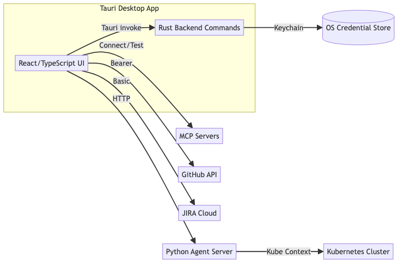
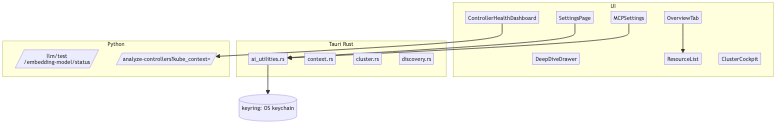
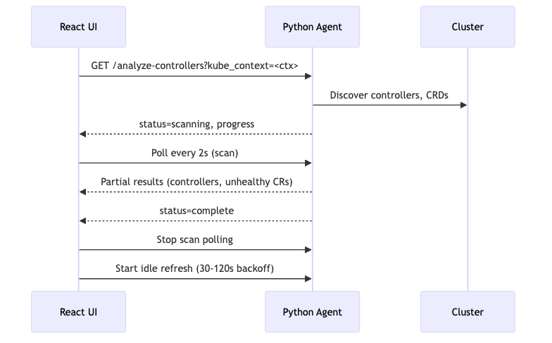
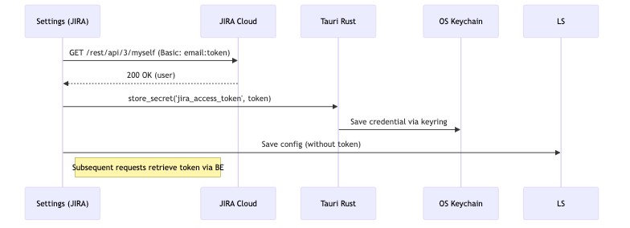
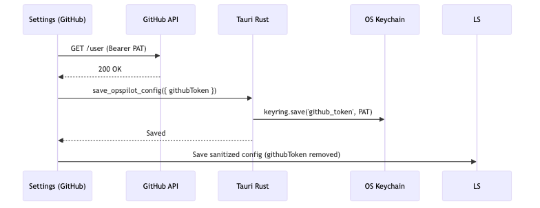
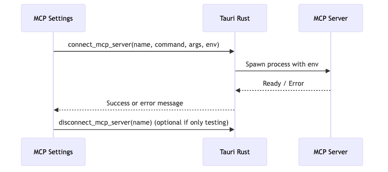

# OpsPilot Knowledge Base

The Knowledge Base (KB) is OpsPilot's semantic search system that provides contextual troubleshooting guidance. It combines pre-built patterns with live cluster discovery to give the AI agent relevant context for your specific environment.

## Design & Architecture

For a high-level overview of OpsPilot’s system and components, see the design doc and diagrams below. These are also useful when onboarding teammates or presenting the platform.

- Design doc: [docs/presentation-design.md](../docs/presentation-design.md)

### System Architecture


### Component Architecture


### Controller Health (Sequence)


### Integration Flows




## How It Works

When you ask OpsPilot a question, it:

1. **Searches the Knowledge Base** - Finds relevant troubleshooting patterns, fixes, and investigation steps

## Document Sources

| Source | Description | Count |
|--------|-------------|-------|
| **Built-in Patterns** | Pre-bundled Kubernetes troubleshooting guides | 57+ patterns |
| **Cluster CRDs** | Auto-discovered from your connected cluster | Dynamic |
| **GitHub Repos** | Indexed from your configured repositories | Configurable |
| **Custom Entries** | Your own `.jsonl` files | User-defined |

## Adding Custom Knowledge

### Step 1: Create the Knowledge Directory

```bash
mkdir -p ~/.opspilot/knowledge

Create a file with the `.jsonl` extension (JSON Lines format - one JSON object per line):

```bash
touch ~/.opspilot/knowledge/my-patterns.jsonl
```

### Step 3: Add Entries

```json
### Entry Schema

|-------|------|----------|-------------|
| `id` | string | Yes | Unique identifier for this entry |
| `category` | string | Yes | Category (e.g., "troubleshooting", "best-practices", "runbook") |
| `symptoms` | string[] | Yes | List of symptoms/queries that should match this entry |
| `investigation` | string[] | No | Steps to investigate the issue |
| `fixes` | string[] | No | Possible solutions |
| `related_patterns` | string[] | No | Related topics for cross-referencing |
| `description` | string | No | Brief description of this pattern |
### Example: Custom Runbook

```json
{"id": "my-app-restart", "category": "runbook", "symptoms": ["my-app not responding", "my-app high latency", "my-app connection refused"], "root_cause": "Application may need restart due to memory leak or stuck connections", "investigation": ["kubectl logs -n production deploy/my-app --tail=100", "kubectl top pod -n production -l app=my-app", "Check Datadog/Grafana dashboards"], "fixes": ["kubectl rollout restart -n production deploy/my-app", "If persists, check PersistentVolume claims", "Escalate to on-call if restart doesn't help"], "related_patterns": ["restart", "memory", "production"]}
```

### Step 4: Re-Index

After adding files, go to **Settings > Memory System > Knowledge Base** and click **Re-Index Data**.

## File Locations

OpsPilot searches for knowledge in these locations (in order):

1. **User Knowledge**: `~/.opspilot/knowledge/*.jsonl`
2. **Bundled Knowledge**: Pre-packaged with OpsPilot
3. **Project Knowledge**: `./knowledge/*.jsonl` (if running from a project directory)

## Understanding Document Counts

When you see messages like "128 docs indexed", this includes:

- **Built-in patterns**: ~57 Kubernetes troubleshooting entries
- **Cluster CRDs**: Varies based on your cluster (Crossplane, Argo, custom operators, etc.)
- **GitHub indexed docs**: From your configured repositories
- **User entries**: Your custom `.jsonl` files

The "No KB entries found in ~/.opspilot/knowledge" message simply means you haven't added custom entries yet - the built-in and cluster-discovered patterns are still active.

## Semantic Search

For best results, semantic search requires:

1. **Ollama installed** with embedding model
2. **nomic-embed-text** model (auto-pulled if missing)
3. Click **Re-Index Data** after adding new entries

Without Ollama, keyword-based search is used as a fallback.

## Tips for Writing Good Entries

1. **Be specific with symptoms** - Include the exact error messages users might search for
2. **Include multiple symptom variations** - "pod crash", "crashloopbackoff", "container restart"
3. **Provide actionable steps** - Investigation and fix steps should be copy-paste ready
4. **Use categories consistently** - Helps with filtering and organization
5. **Add related patterns** - Improves cross-referencing

## Example Patterns

### Troubleshooting Pattern

```json
{
  "id": "custom-crd-sync-failed",
  "category": "troubleshooting",
  "symptoms": [
    "CRD not syncing",
    "custom resource stuck",
    "operator not reconciling"
  ],
  "root_cause": "Operator controller may be crashed or CRD schema mismatch",
  "investigation": [
    "kubectl get pods -n operators",
    "kubectl logs -n operators deploy/<operator-name>",
    "kubectl describe <crd-kind> <name>"
  ],
  "fixes": [
    "Restart the operator: kubectl rollout restart -n operators deploy/<operator-name>",
    "Check CRD version compatibility",
    "Verify RBAC permissions for the operator"
  ],
  "related_patterns": ["operator", "crd", "reconciliation"]
}
```

### Best Practice Pattern

```json
{
  "id": "resource-limits-best-practice",
  "category": "best-practices",
  "symptoms": [
    "how to set resource limits",
    "pod resource configuration",
    "prevent OOMKilled"
  ],
  "description": "Best practices for setting container resource limits",
  "investigation": [
    "Review current resource usage: kubectl top pods",
    "Check historical metrics in monitoring system"
  ],
  "fixes": [
    "Set requests to P50 usage, limits to P99",
    "Use VPA for automatic recommendations",
    "Implement LimitRanges for namespace defaults"
  ],
  "related_patterns": ["resources", "limits", "requests", "vpa"]
}
```

## Troubleshooting

### Knowledge Base shows "OFFLINE"

1. Ensure Ollama is running: `ollama serve`
2. Pull the embedding model: `ollama pull nomic-embed-text`
3. Click "Re-Index Data" in settings

### Custom entries not appearing

1. Check file is valid JSONL (one JSON object per line)
2. Verify file extension is `.jsonl`
3. Ensure file is in `~/.opspilot/knowledge/`
4. Click "Re-Index Data" after adding files

### Search not finding relevant results

1. Add more symptom variations to your entries
2. Include exact error messages as symptoms
3. Use related_patterns for better cross-referencing

## MCP Servers Setup

First-time connection to MCP (Model Context Protocol) servers is easiest if you follow these steps:

1. Tooling prerequisites

## First-Time Setup (Clean System)

If you’re starting with a clean machine, install these tools. OpsPilot uses them to keep setup simple, secure, and local-first:

- Node.js (`npx`): Runs official MCP servers published on npm without global installs.
- uv (`uvx`): Fast Python package runner for MCP servers written in Python.
- Ollama: Local embeddings for semantic search; keeps your code and knowledge private.

Install commands (macOS):

```bash
# Node.js (Homebrew)
  - Install uv (for `uvx`): https://docs.astral.sh/uv/
  - Ensure Node.js (`npx`) is available: https://nodejs.org/
2. Open Settings → MCP Servers
  - Add a server from Presets (e.g., Kubernetes, GitHub, Azure DevOps) or create a Custom one.
3. Fill required environment values
  - Tokens and paths are highlighted; use “Browse…” for file paths like kubeconfig.
4. Click Test
  - Validates the command, args, and env without keeping a long-lived connection.
5. Click Connect and optionally enable Auto-connect
  - Auto-connect starts the server automatically when the app launches.

Why these tools
- npx: Executes official MCP servers directly from the registry → less friction, auto-updates, no global clutter.
- uvx: A secure, reproducible way to run Python-based MCP servers without manual venv management.
- Ollama: Local vector embeddings power semantic KB; avoids sending data to external services.

Next steps in OpsPilot
1. Open Settings → MCP Servers → Explore Presets; add the ones you need (e.g., Kubernetes, GitHub).
2. Fill env values (tokens, kubeconfig path); use Browse for file paths.
3. Click Test; fix any errors; then Connect.
4. Toggle Auto-connect if you want the server to start with the app.

Agent & AI quick tests
- In Settings → Agent & AI, use “Test Agent Server” to verify the backend URL is reachable.
- Use “Test Embeddings” to confirm your embedding endpoint or local Ollama is ready.

Tips
- Official servers are marked with a shield icon; prefer them when possible.
- For Azure DevOps preset, replace `YOUR_ORG_NAME` with your actual organization.
- Use the “View Error” link on a server to see diagnostics and troubleshooting hints.
