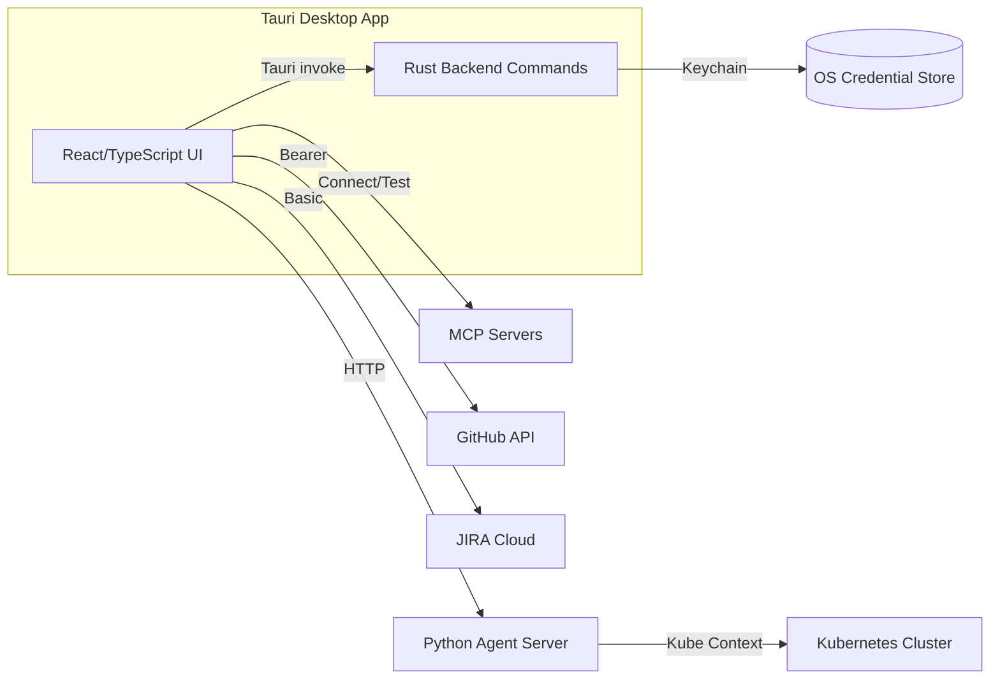
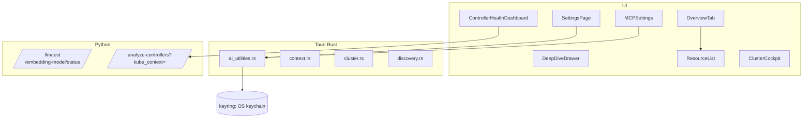
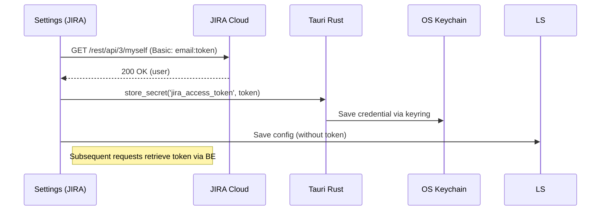
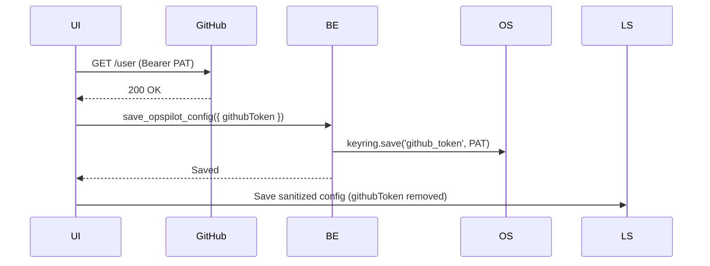
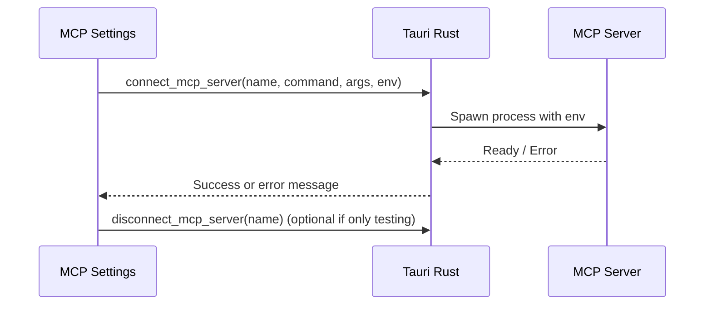

# OpsPilot Presentation & Design Document

A comprehensive, user-facing presentation of OpsPilot — an AI-assisted Kubernetes cockpit — detailing goals, architecture, data flows, security posture, UX, and operations.

## Table of Contents
- Vision & Goals
- Key Features
- System Architecture
- Component Architecture
- Data Flows (Mermaid)
- Security & Privacy
- Configuration & Persistence
- User Experience Walkthroughs
- Integrations: MCP, GitHub, JIRA, Azure
- Knowledge Base & Embeddings
- Performance & Reliability
- Observability
- Platform Support
- Roadmap

---

## Vision & Goals
- Purpose: A fast, trustworthy cockpit to understand and operate Kubernetes clusters using an AI agent with local-first privacy.
- Principles:
  - Local-first: prefer local embeddings and keychain storage.
  - Actionable: expose relevant signals (controllers, CRDs, unhealthy resources) with one-click diagnostics.
  - Secure-by-default: tokens in OS keychain, sanitized settings, redacted logs.
  - Frictionless onboarding: test buttons, guided MCP setup, self-checks.

## Key Features
- Controller Health Dashboard: auto-discovery, scan progress, filters, sticky summary, deep links.
- Resource Deep Dive: overview explainer, relationships (`ResourceChain`), inline details for `Service` and `Ingress`.
- Settings:
  - Agent & AI: Test agent server and embeddings.
  - Integrations: GitHub PAT, JIRA Cloud token (keychain-backed), connection tests.
  - MCP Servers: quick start banner, tool detection (uvx, npx), per-server test and auto-connect.
- Knowledge Base (KB): semantic search, cluster CRDs indexing, custom JSONL.

## System Architecture



## Component Architecture



## Data Flows (Mermaid)

### Controller Health Scan
```mermaid
sequenceDiagram
  participant UI as React UI
  participant Agent as Python Agent
  participant K8s as Cluster

  UI->>Agent: GET /analyze-controllers?kube_context=<ctx>
  Agent->>K8s: Discover controllers, CRDs
  Agent-->>UI: status=scanning, progress
  UI->>Agent: Poll every 2s (scan)
  Agent-->>UI: Partial results (controllers, unhealthy CRs)
  Agent-->>UI: status=complete
  UI->>UI: Stop scan polling; start idle refresh (30–120s backoff)
```

### JIRA Connect & Token Storage


### GitHub Test & Sanitized Save


### MCP Server Test


## Security & Privacy
- Tokens & Secrets:
  - GitHub PAT and JIRA API Token stored in OS keychain (via `keyring`).
  - MCP env secrets stored in app settings; masked in UI; recommend using external env/secret files for higher security.
- Sanitization:
  - Settings writes omit tokens; diagnostic exports redact sensitive fields.
- Networking:
  - Agent server endpoints are local by default (127.0.0.1). No code or knowledge leaves machine when using local embeddings.
- Logs:
  - Structured logs with levels; export redacts keys; user-controlled clearing.

## Configuration & Persistence
- Config File: `~/.opspilot.json` for non-secret settings.
- Keychain: secrets via `store_secret`/`retrieve_secret` Tauri commands.
- localStorage: UI state, MCP connections, sanitized settings.
- Knowledge Base: `~/.opspilot/knowledge/*.jsonl` (user), `./knowledge/*.jsonl` (project), bundled patterns.

## User Experience Walkthroughs
- First-time Setup:
  - Install Node.js, `uvx`, and Ollama.
  - Open Settings → Agent & AI, test Agent and Embeddings.
  - Configure GitHub and JIRA (tokens stored in keychain); test connections.
  - Setup MCP servers; use Presets; fill env; Test → Connect → Auto-connect.
- Controller Health:
  - Auto-loads data; scan shows progress; sticky summary and filters; deep link into controllers and unhealthy CRs.
- Deep Dive:
  - Friendly explainers in OverviewTab for each kind; relationships via `ResourceChain`.

## Integrations: MCP, GitHub, JIRA, Azure
- MCP Servers: official and community; uvx/npx runners; quick tests.
- GitHub: PAT with `repo` scope; secure storage; search and doc indexing.
- JIRA: Cloud token; secure storage; issue creation and project defaults.
- Azure: AKS insights via Monitor; subscription enumeration; aggregation split/merge for resilient 1-hour insights.

## Knowledge Base & Embeddings
- Sources: built-in patterns, cluster CRDs, GitHub repos, user `.jsonl`.
- Embeddings: local via Ollama (`nomic-embed-text`) or custom endpoint.
- Re-index: Settings action; semantic search uses embeddings; fallback to keyword search when offline.

## Performance & Reliability
- Controller Health polling: 2s during scans; idle refresh 30–120s backoff.
- UI skeletons prevent blank states; async error cards.
- Minimal global re-render; grid and card lists optimized.

## Observability
- Logs: centralized via frontend logger; stats in Settings → Diagnostics.
- Agent: health test via `/llm/test`; embeddings status endpoint.

## Platform Support
- macOS: native Keychain; Apple Silicon support; Homebrew-friendly.
- Windows: Credential Manager; DPAPI via `keyring`.
- Linux: Secret Service (libsecret); GNOME Keyring compatible.

## Roadmap
- Filters: multi-criteria and search within Controller Health.
- Events quick actions: per-controller events view and common fixes.
- Enhanced onboarding: per-integration tooltips, docs links.
- Backoff tuning and transient network heuristics.
- Optional cloud-based embeddings with strict opt-in.

---

## Appendix: Key Files & Endpoints
- UI: `src/components/cluster/ControllerHealthDashboard.tsx`, `src/components/settings/SettingsPage.tsx`, `src/components/settings/MCPSettings.tsx`, `src/components/cluster/deep-dive/OverviewTab.tsx`.
- Backend (Tauri): `src-tauri/src/commands/ai_utilities.rs` (keychain), `src-tauri/src/commands/discovery.rs`, `src-tauri/src/commands/context.rs`.
- Agent: `/llm/test`, `/embedding-model/status`, `/analyze-controllers`.
- Docs: `docs/knowledge-base.md`, `docs/presentation-design.md`.
